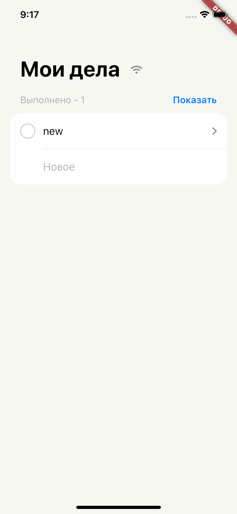
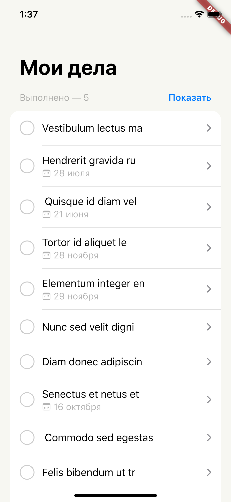
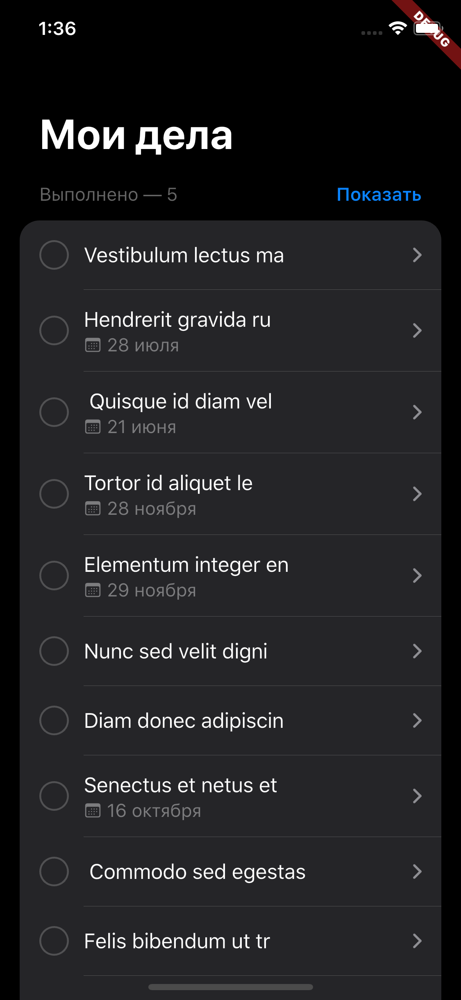
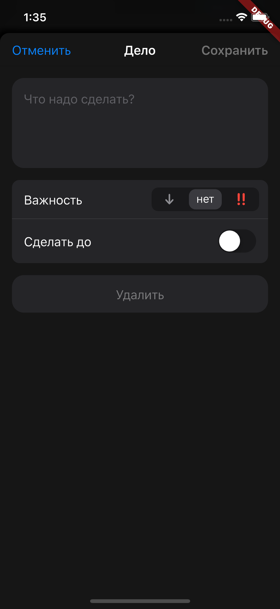
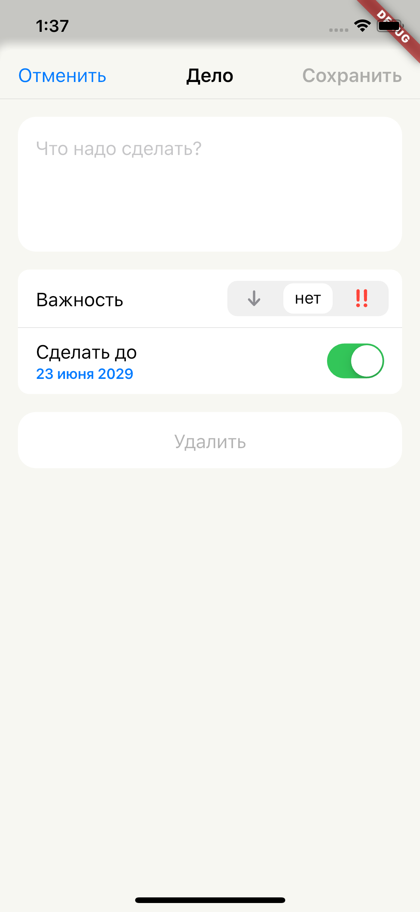

# TODO App

## Как запустить?

### _Кручу верчу, `.env` файл секретами подменю_ ✨

> Заполнить секретные значения

```shell
cp .env.example .env
```

### Посадить в лунку 😅!

> Установить зависимости

```shell
dart pub global activate very_good_cli
very_good packages get --recursive
```

### Жив ли 😇?

> Протестировать

```shell
very_good test --recursive
```

### Поиграемся 🤪?

> Запустить в режиме отладки

```shell
flutter run
```

### Выкопать 🎃!

> Собрать пакет

```shell
flutter build apk
flutter build appbundle
flutter build ipa
flutter build web
flutter build macos
flutter build windows
flutter build linux
```

## Futures (Фичи)

- Просмотр списка задач
- Создание/редактирование задачи
- Переход между страницами
- Удаление элемента, через смахивание
- Логгирование и crash-reports через сервис Sentry
- Подключён API
- Подключено локальное хранение данных
- Статус есть ли интернет, через иконку рядом с названием главной страницы
- Синхронизация данных каждые 30сек
- Повтораная попытка отправить пакеты в случае серверных или сетевых ошибок по экспонентному времени

### Архитектура

- Layer-first Архитектура
- Работа с данными выделена в отдельный пакеты
    - ./packages/local_storage_todos_api
    - ./packages/remote_storage_todos_api
    - ./packages/network_state_provider
    - ./packages/todos_api
    - ./packages/todos_repository

### Инфраструктура (CI-CD)

> Github Workflow

- форматирование
- анализ
- тестирование
- сборка
- деплой на getupdraft

### Тестирование

- Тестрование локального API
- Тестрование удалённого API

## APK файлы

Тут [релиз](https://github.com/coma8765/literate-computing-machine/releases/tag/part-03).

## Screenshots

<p float="left">
  
  
  
  
  
</p>
